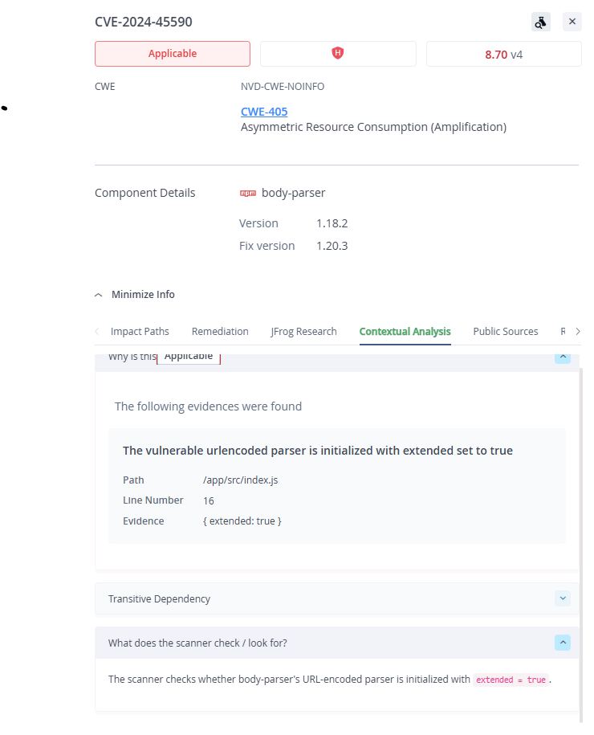
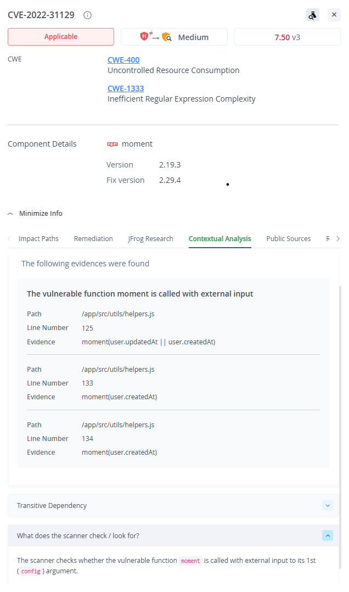

# Findings: Xray scan with Contextual Analysis

Scanned artifact: `docker-local/user-management-service:baseline` (this repo,
unmodified, built from the Dockerfile as cloned). Platform: royab.jfrog.io,
JFrog Advanced Security enabled. Full raw data in
[docs/evidence/baseline-security-export.csv](evidence/baseline-security-export.csv);
scan stage completion in
[docs/evidence/baseline-scan-status.csv](evidence/baseline-scan-status.csv).

## The raw picture

171 unique CVEs: 19 Critical, 67 High, 71 Medium, 14 Low. A flat list this
size is not a work queue - it is a triage problem. Contextual analysis
reduced it to 22 findings whose vulnerable code is actually reachable in
this image, and only 2 of those are High severity issues in the
application's own dependency tree.

| | Critical | High | Medium | Low |
|---|---|---|---|---|
| All unique CVEs | 19 | 67 | 71 | 14 |
| Applicable (contextual analysis) | 1 | 14 | 5 | 2 |
| Applicable, application-level (npm) | 0 | **2** | 2 | 0 |

The applicable Critical and 12 of the 14 applicable Highs are operating
system packages (`libcrypto3`/`libssl3`) inherited from the `node:14-alpine`
base image, which is end of life. They are real, but the remediation is one
line in the Dockerfile (a supported base image), not application work.

## The two applicable application-level Highs

### 1. CVE-2024-45590 - body-parser < 1.20.3 (DoS)

- **Where it comes from:** transitive dependency of `express@4.16.1`
  (`package.json` pins express; express bundles body-parser).
- **Why it is applicable here:** the vulnerability is a denial of service
  when parsing URL-encoded bodies with extended encoding enabled. This app
  enables exactly that in `src/index.js`:
  `app.use(express.urlencoded({ extended: true }))`. Every endpoint behind
  this middleware is exposed to the attack.
- **Fix version:** body-parser 1.20.3 (bundled from express 4.21.x).

### 2. CVE-2022-31129 - moment 2.18.0 <= v < 2.29.4 (ReDoS)

- **Where it comes from:** direct dependency, `moment@2.19.3` in
  `package.json`.
- **Why it is applicable here:** inefficient regex in moment's RFC 2822
  date-string preprocessing allows crafted strings to consume CPU
  quadratically, so the attack surface is any call that parses a string.
  The scanner found exactly that: `moment(user.updatedAt || user.createdAt)`
  and `moment(user.createdAt)` in `src/utils/helpers.js` (lines 125-134),
  where user-record fields flow into the vulnerable parser. The many
  argument-less `moment()` calls in `src/index.js` (logging, health, auth)
  load the library but parse nothing, so they are not the attack surface.
- **Fix version:** moment 2.29.4 (same major version, API compatible).
- **Severity note:** counted as High per NVD/CVSS (7.5), consistent with the
  table above; JFrog Research rates its contextual severity Medium because
  the exploitation preconditions are narrow.

## Also surfaced by the scan (not the assignment's two, listed for honesty)

- 2 applicable Medium CVEs in `lodash@4.17.4` (CVE-2018-16487 prototype
  pollution, CVE-2020-28500 ReDoS); fix is 4.17.21.
- A hardcoded JWT secret in `src/index.js` (secrets scan). Not a CVE, but
  the kind of finding that would block a release under a policy gate.
- Of the 86 High/Critical unique CVEs, 63 are marked **Not Applicable**
  with evidence, 5 **Undetermined**, and 3 **Not Covered** (no applicability
  scanner for that CVE class); see CONTEXTUAL-ANALYSIS.md for why those
  three states must be treated differently.

Remediation of one applicable High is documented in REMEDIATION.md.
