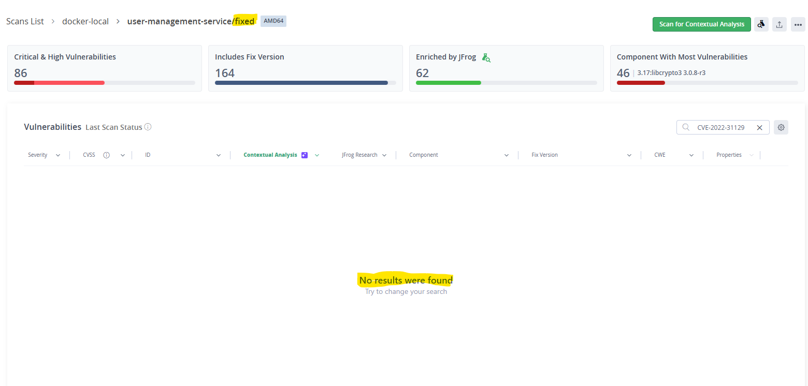

# Remediation: CVE-2022-31129 (moment, applicable High)

## Which vulnerability, and why this one

Of the two applicable application-level Highs found in FINDINGS.md, I
remediated **CVE-2022-31129** in `moment@2.19.3`: a regular-expression
denial of service in moment's RFC 2822 date-string preprocessing, fixed in
2.29.4.

Chosen because it is the cleanest demonstration of a full
find-fix-verify loop:

- `moment` is a **direct** dependency, so the fix is a one-line version bump
  under my control. The other applicable High (CVE-2024-45590, body-parser)
  arrives transitively through `express@4.16.1`, so its real fix is an
  express upgrade - see "the other High" below.
- 2.19.3 to 2.29.4 stays inside the same major version. This app uses
  moment only as `moment().format(...)`, `moment().toISOString()` and
  `moment().unix()` on the current time, all stable across 2.x, so the
  upgrade carries no code changes and no behavioral risk.

## Why upgrade, versus the alternatives

| Option | Verdict |
|---|---|
| **Upgrade to 2.29.4** | Chosen: removes the vulnerable code entirely, one line, API compatible |
| Patch / fork the dependency | Maintenance burden forever, for a fix upstream already shipped |
| Replace moment (dayjs, date-fns) | Right long-term (moment is in maintenance mode) but touches every call site; wrong scope for a security fix |
| Mitigate in code (input length caps) | The app never parses user-supplied date strings, so a mitigation would guard a path that does not exist here; version stays flagged by every scanner |

## Pre-step: the app could not run at all as cloned

Proving "the app still works" first required making it work: `src/`
requires two packages that `package.json` never declared, so `npm start`
crashed with MODULE_NOT_FOUND on a fresh clone.

- `bcrypt` (used by the login endpoint) - added, pinned 5.1.1 (last major
  supporting node 14).
- `validator` (used by user routes and helpers) - added, pinned 13.11.0.

Each is its own commit, separate from the CVE fix.

## The fix

```diff
-    "moment": "2.19.3",
+    "moment": "2.29.4",
```

## Proof the app works after the fix

Built `docker-local/user-management-service:fixed` from this repo and ran it:

```
$ curl -s http://localhost:3000/health
{"status":"healthy","timestamp":"2026-08-15T13:33:33.035Z","version":"1.0.0"}

$ curl -s -X POST http://localhost:3000/api/auth/login \
    -H "Content-Type: application/json" \
    -d '{"username":"demo","password":"secret123"}'
{"success":true,"token":"eyJhbGciOiJIUzI1...","user":{"username":"demo"},...}
```

The health check, the moment-based logging middleware, and the
bcrypt/JWT login path (which exercises `moment().unix()` and
`moment().toISOString()`) all behave as before.

## Proof the vulnerability is gone

The `:fixed` image was pushed to Artifactory and rescanned by Xray with
contextual analysis. CVE-2022-31129 no longer appears in the results
(moment 2.29.4 is outside the vulnerable range 2.18.0 <= v < 2.29.4).



## The other High, honestly

CVE-2024-45590 (body-parser) remains applicable in the fixed image. Its
correct fix is upgrading `express` 4.16.1 to 4.21.x (which bundles
body-parser >= 1.20.3); that also clears several express CVEs but has a
wider blast radius (middleware behavior changes between 4.16 and 4.21) and
deserves its own tested change rather than being smuggled into this one.
The scan-driven queue after this remediation is: express upgrade, then the
`node:14-alpine` base image (EOL, source of the applicable OS-level
Critical and 12 Highs), then the hardcoded JWT secret.
